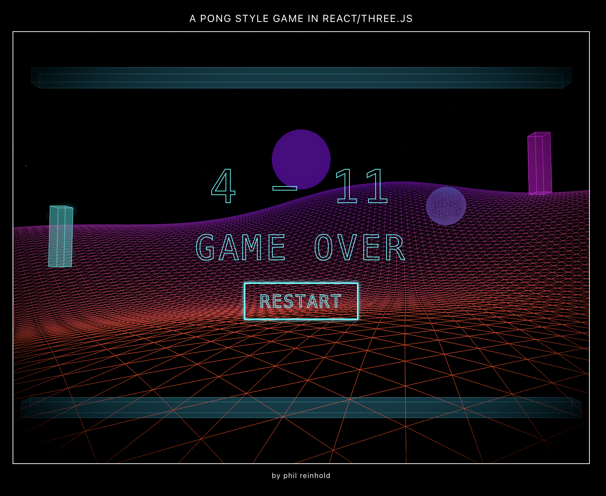

# // 3D Pong Style Game // #

A minimalistic 3D Pong-inspired Web-game built with React and Three.js.


## Video Demo

[Watch the Youtube Video / CS 50](https://youtu.be/okflGRyM2ZI)

## About ##

I'm a Millenial 8-) and fascinated by 80s Synthwave graphics and wanted to experiment with Three.js and React within these combinations. This project is a bit of a playground for creating a minimalist game while exploring the interactive possibilities of the Three.js/React combo. Pong is just a starting point - I'm excited to dive deeper into React/Three/Fiber for future projects. It's a lot of fun experimenting with three and react!

## Controls ##

- Player: Up Arrow (up), Down Arrow (down)
- Start/Restart: On-screen buttons

## Technologies Used ##

- **React**: 
- **Three.js**: 
- React Three Fiber Render pipeline

## Installation

1. Ensure you have Node.js installed on your system.
2. Clone this repository to your local machine.
3. Navigate to the project directory in your terminal.
4. Run the following command to install the necessary dependencies:
   ```
   npm install react three @react-three/fiber @react-three/drei @react-three/postprocessing
   ```
5. Once the installation is complete, start the development server with:
   ```
   npm start
   ```
6. Open your browser and visit `http://localhost:3000` to play the game.

:-)) 



## File Structure and Design Choices ##

- **src/components**: Contains the components of the game, `Paddle`, `Ball`, and `GameManager`.
- **src/assets**: The Pong Sound and Screenshot images...
- **src/App.js**: Put all main entry and logic in the App.js

### Design Choices ###
My decision to use React Three Fiber was mainly cause of my curiosity of blending my Art and code inside React with Three.js and i had these Snythwave sound in my head so…

## Acknowledgements ##

- **CS50**: deepening additional foundation of my programming knowledge.
- **React Three Fibre Documentation** https://r3f.docs.pmnd.rs/getting-started/your-first-scene 
- **O´Reilly / Javascript**: Book The Definitive Guide: Master the World's Most-Used Programming Language
- https://discourse.threejs.org/ Three.js Documentation & Forum
  

