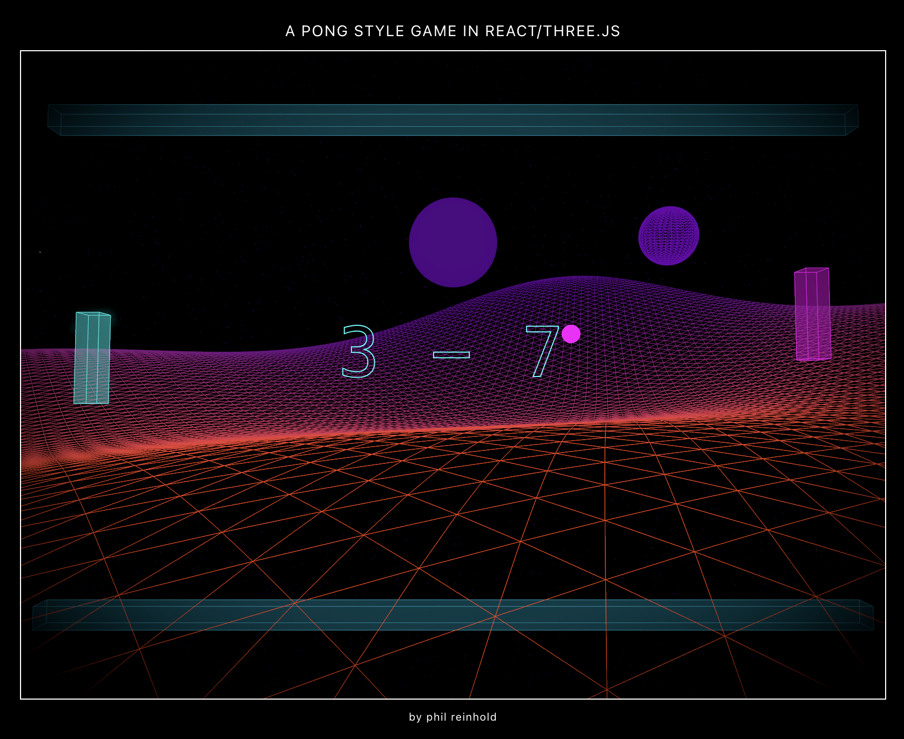

# // 3D Pong Style Game // #

A minimalistic 3D Pong-inspired Web-game built with React and Three.js.



## About ##

I'm fascinated by 80s graphics and wanted to experiment with Three.js and React. This project is my playground for creating a minimalist game while exploring the interactive possibilities of the Three.js/React combo. Pong is just a starting point - I'm excited to dive deeper into React/Three/Fiber for future projects. It's been a blast experimenting with these technologies!

## Features ##

- 3D graphics powered by Three.js
- Responsive design
- Dynamic lighting and post-processing effects
- AI-like opponent
- Score tracking
- Retro-inspired visuals

## Controls ##

- Player: Up Arrow (up), Down Arrow (down)
- Start/Restart: On-screen buttons

## Tech Stack

- React
- Three.js
- React Three Fiber
- PostProcessing effects

## Installation

1. Ensure you have Node.js installed on your system.
2. Clone this repository to your local machine.
3. Navigate to the project directory in your terminal.
4. Run the following command to install the necessary dependencies:
   ```
   npm install react three @react-three/fiber @react-three/drei @react-three/postprocessing
   ```
5. Once the installation is complete, start the development server with:
   ```
   npm start
   ```
6. Open your browser and visit `http://localhost:3000` to play the game.

:-)) 
